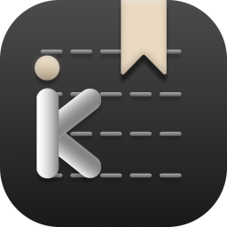
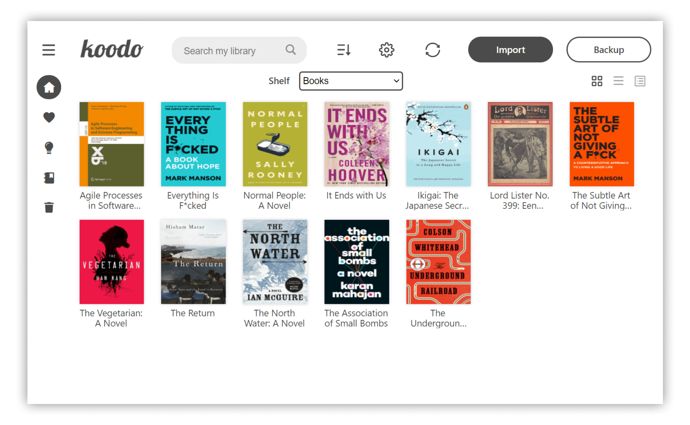
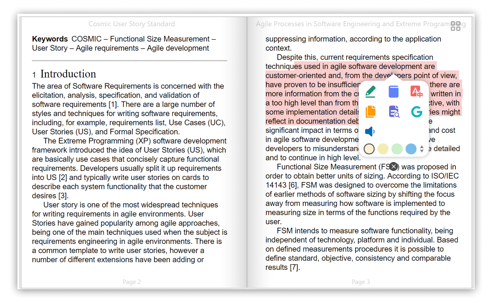
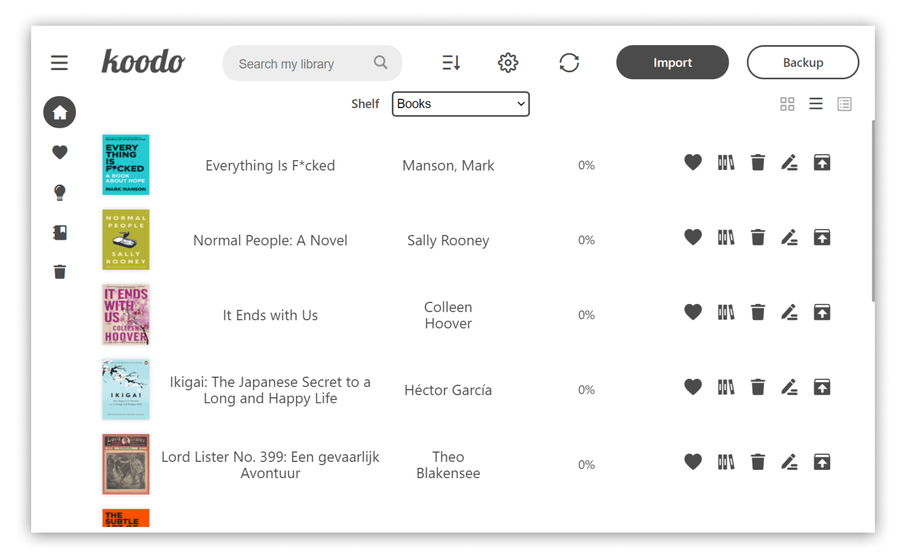
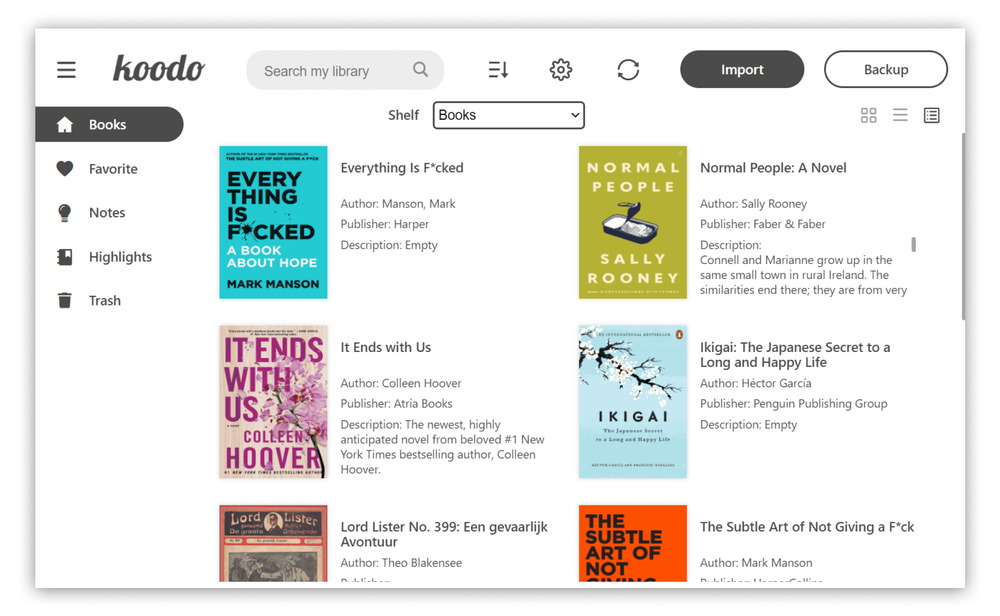
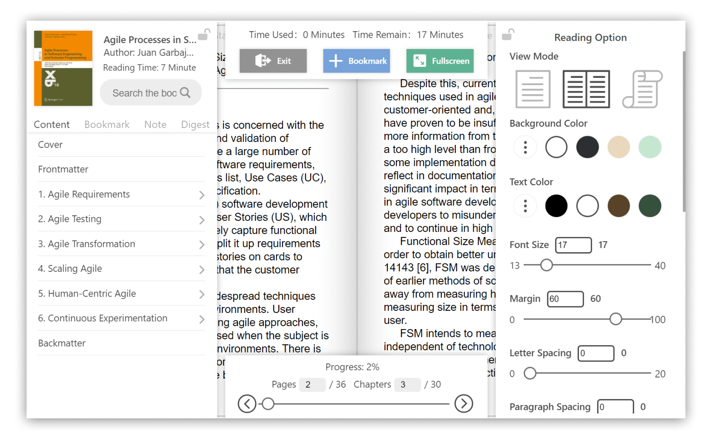
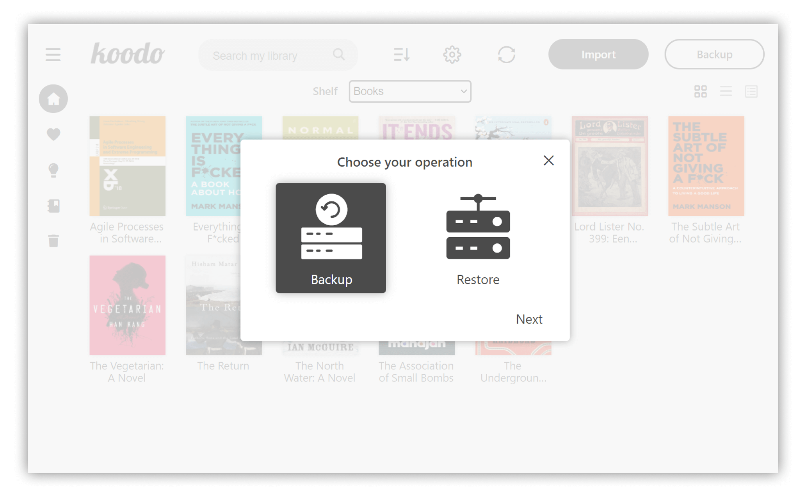
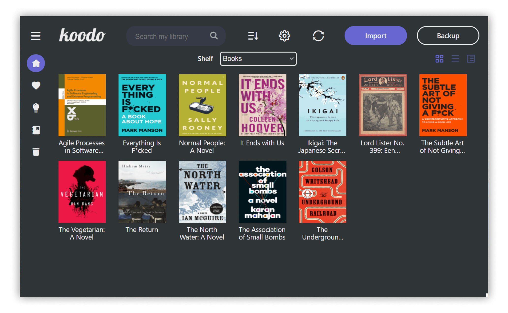
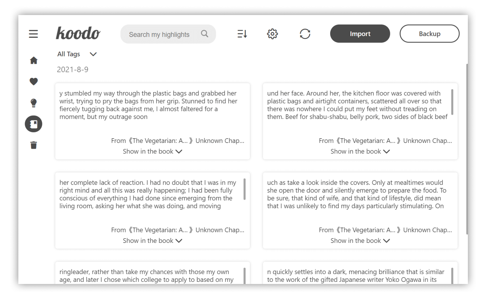

<div align="left">

[简体中文](https://github.com/troyeguo/koodo-reader/blob/master/README_cn.md) | English

</div>

<div align="center" >

</div>

<h1 align="center">
  Koodo Reader
</h1>

<h3 align="center">
  A cross-platform ebook reader
</h3>
<div align="center">

[Download](https://koodo.960960.xyz/download) | [Preview](https://koodo-reader.vercel.app/) | [Feedback](https://koodo.960960.xyz/support) | [Document](https://www.notion.so/troyeguo/01aaa516687c418499f713d34793b9ad?v=54d51fe1688a4f8ab5784b17e4df3308)

</div>

## Preview

<div align="center">
  <a href="https://github.com/troyeguo/koodo-reader/releases/latest">
    
  </a>
  <a href="https://github.com/troyeguo/koodo-reader/releases/latest">
    
  </a>
</div>

## Feature

- Format support:
  - EPUB (**.epub**)
  - Scanned document (**.pdf**, **.djvu**)
  - Kindle (**.azw3**) and Mobipocket (**.mobi**)
  - Plain text (**.txt**)
  - FictionBook (**.fb2**)
  - Comic book archive (**.cbr**, **.cbz**, **.cbt**)
  - Rich text (**.md**, **.docx**, **.rtf**)
  - Hyper Text (**.html**, **.xml**)
- Platform support: **Windows** , **macOS**, **Linux** and **Web**
- Save your data to **Dropbox** or **Webdav**
- Customize the source folder and synchronize among multiple devices using OneDrive, iCloud, Dropbox, etc.
- Single-column, two-column, or continuous scrolling layouts
- Text-to-speech, translation, progress slider, touch screen support, batch import
- Add bookmarks, notes, highlights to your books
- Adjust font size, font family, line-spacing, paragraph spacing, background color, text color, margins, and brightness
- Night mode and theme color
- Text highlight, underline, boldness, italics and shadow

## Installation

- Desktop Version:
  - Stable Version (Recommended): [Download](https://koodo.960960.xyz/download)
  - Developer Version: [Download](https://github.com/troyeguo/koodo-reader/releases/latest) ( With new feature and bug fix, but may induce some unknown bugs)
- Web Version：[Preview](https://koodo-reader.vercel.app/)
- Install with Homebrew:

```shell
brew install --cask koodo-reader
```

- Install with Docker:

```bash
docker-compose up -d
```

## Screenshot

<div align="center">
  <b>List mode</b>
  <a href="https://github.com/troyeguo/koodo-reader/releases/latest">
    
  </a>
  <b>Cover mode</b>
  <a href="https://github.com/troyeguo/koodo-reader/releases/latest">
    
  </a>
  <b>Reader menu</b>
  <a href="https://github.com/troyeguo/koodo-reader/releases/latest">
    
  </a>
  <b>Backup and restore</b>
  <a href="https://github.com/troyeguo/koodo-reader/releases/latest">
  
  </a>
  <b>Dark mode and theme color</b>
  <a href="https://github.com/troyeguo/koodo-reader/releases/latest">
  
  </a>
  <b>Note management</b>
  <a href="https://github.com/troyeguo/koodo-reader/releases/latest">
  
  </a>

</div>

## Develop

Make sure that you have installed yarn and git, node's version on your computer is larger than 14.0.0.

1. Download the repo

   ```
   git clone https://github.com/troyeguo/koodo-reader.git
   ```

2. Enter desktop mode

   ```
   yarn
   yarn dev
   ```

3. Enter web mode

   ```
   yarn
   yarn start
   ```

## License

This project is generally licensed under AGPL3.0, but any kind of modification of source code for commercial projects or alternation on logo or name are not allowed.
