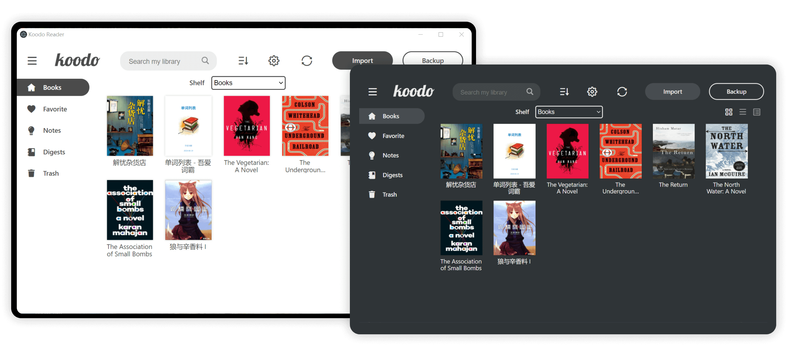

<div align="center">

简体中文 | [繁體中文](https://github.com/troyeguo/koodo-reader/blob/master/README_tw.md) | [English](https://github.com/troyeguo/koodo-reader/blob/master/README.md)

</div>

<div align="center">

</div>

<h1 align="center">
  Koodo Reader
</h1>
<h3 align="center">
  一个跨平台的电子书阅读器
</h3>
<div align="center">

[下载](https://koodo.960960.xyz/download) | [官网](https://koodo.960960.xyz) | [反馈](https://koodo.960960.xyz/support) | [文档](https://www.notion.so/troyeguo/e9c4e5755d564b0db6340eeba6d9ece9?v=7c8fcbed9adf4592ada95cfd593868c9) | [计划](https://www.notion.so/troyeguo/215baeda57804fd29dbb0e91d1e6a021?v=360c00183d944b598668f34c255edfd7)

</div>

## 预览

<div align="center">
  <a href="https://github.com/troyeguo/koodo-reader/releases/latest">
    
  </a>
  <br/>
</div>

## 特色

- 支持阅读 **epub**, **pdf**, **mobi**, **azw3**, **txt**, **md**, **djvu**, **docx**, **rtf**, **cbz**, **cbr**, **cbt**, **fb2**, **html** 和 **xml** 格式的图书

- 支持 **Windows**，**macOS**，**Linux** 和 **网页版**

- 备份数据到 **Dropbox** 和 **Webdav**

- 自定义源文件夹，利用 OneDrive、百度网盘、iCloud、Dropbox 等进行多设备同步

- 双页模式，单页模式，滚动模式

- 听书功能，翻译功能，触控屏支持，批量导入图书

- 支持目录，书签，笔记，书摘，书架，标签

- 自定义字体，字体大小，行间距，段落间距，阅读背景色，文字颜色，屏幕亮度，文字下划线、斜体、文字阴影、字体粗细

- 黑夜模式和主题色设置

## 使用方法

- 桌面端：[Github](https://github.com/troyeguo/koodo-reader/releases/latest) | [蓝奏云](https://wwa.lanzoui.com/b0c90cieb) 密码：1234 | [历史版本](https://wwa.lanzoui.com/b0c97tupi) 密码：1234

- 网页版：[前往](https://reader.960960.xyz)

- 使用 [Homebrew](https://brew.sh/) 安装：

```shell
brew install --cask koodo-reader
```

- 使用 Docker 安装：

```bash
docker-compose up -d
```

## 运行源码

请确保您电脑的 node 的版本大于 10.0.0，已配置好 yarn，git 的运行环境。

1. 将项目源码下载到本地

   ```
   git clone https://github.com/troyeguo/koodo-reader.git
   ```

2. cd 到项目文件夹，运行以下代码进入客户端模式

   ```
   yarn
   yarn dev
   ```

3. 运行以下代码进入网页模式

   ```
   yarn
   yarn start
   ```

## 贡献

| 贡献          | 感谢                                                                                       |
| :------------ | :----------------------------------------------------------------------------------------- |
| 繁体中文翻译  | [TobySkarting](https://github.com/TobySkarting), [playercd8](https://github.com/playercd8) |
| 俄语翻译      | [vanja-san](https://github.com/vanja-san)                                                  |
| Homebrew 安装 | [singularitti](https://github.com/singularitti)                                            |
| Docker 安装   | [yanickxia](https://github.com/yanickxia)                                                  |
| 其他贡献者    | [bamlan](https://github.com/bamlan)                                                        |

## 帮助

您可以在[issue](https://github.com/troyeguo/koodo-reader/issues)提问，或者前往[这里](https://koodo.960960.xyz/support)了解更多。
